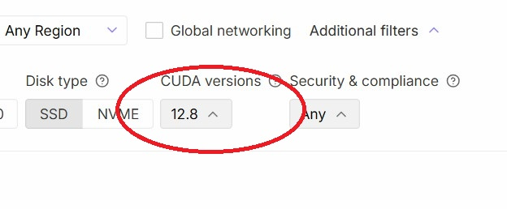
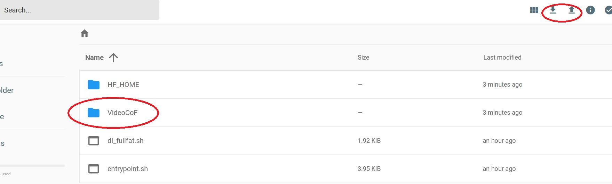
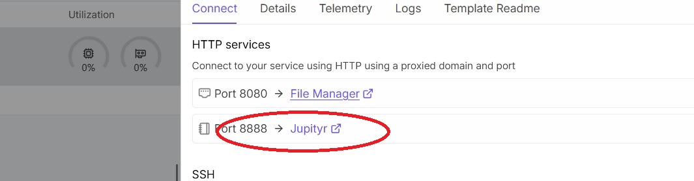
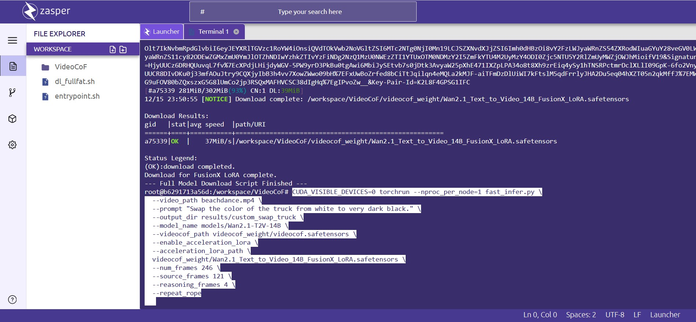

# HOWTO: Use Edit Models on Video with Hosted GPUs

This repository provides a step-by-step guide to running cutting-edge video editing models on a hosted GPU environment. 

The specific example demonstrated here is converting a vehicle's color from white to black in a video clip using **Video Generation and Editing Models** (specifically, $\text{VideoCoF}$ and $\text{Wan 2.1}$ FusionX).

---

## 1. Prerequisites and GPU Selection

Due to the size of the model (70+ GB) and the complexity of the $\text{Chain-of-Thought}$ ($\text{CoT}$) reasoning process, a high-performance, high-VRAM GPU is mandatory.

### Hardware and CUDA Requirement

The model inference process requires a substantial amount of video memory (VRAM) and a modern CUDA toolkit version:

* **Minimum VRAM:** Approximately $\sim 40 \text{ GB}$ VRAM.
* **CUDA Compatibility:** The Docker image uses **CUDA 12.8** or better. If selecting a GPU older than NVIDIA's Blackwell architecture, care must be taken to ensure the GPU and its driver support this CUDA version.

  

* **Suitable GPU:** An $\text{NVIDIA RTX 6000 Pro}$, $\text{A100}$, $\text{H100}$, or $\text{L40}$ series GPU is recommended for reliable and fast execution.
* **Inference Time:** Expect run times of approximately $\sim 10$ minutes per 5-second clip (121 frames) on a RTX6000 Pro.

### Deployment

The entire environment, including all required models and dependencies, is pre-configured in a custom RunPod template.

**Please use this referral link to deploy the prepared template:**

[**Deploy VideoCoF Edit Model on RunPod**](https://console.runpod.io/deploy?template=p8d48bksvl&ref=p35frl2l)

---

## 2. Step-by-Step Deployment and Setup

This process guides you from template deployment to execution in the hosted environment.

### A. Deployment and Initial Setup

1.  **Click Deploy Link:** Navigate to the pre-configured template using [this link](https://console.runpod.io/deploy?template=p8d48bksvl&ref=p35frl2l).
2.  **Select GPU:** Review and select a suitable GPU that meets the VRAM and CUDA 12.8 compatibility requirements.
3.  **Review & Deploy:** Review the instance settings and deploy the pod.
4.  **Wait for Services:** Wait for the pod to provision and start. The connections panel will populate with links (Connect, Jupyter, File Manager).

### B. Uploading the Source Video

1.  **Open File Manager:** Click the **File Manager** button that appears in the connections panel. This opens the file browser in a new tab.

    

2.  **Navigate to Project Folder:** Double-click the **`VideoCoF`** folder.
3.  **Upload Video:** Click the **Upload Icon** (cloud icon with an up arrow), select the **File** option, and upload your source video file (e.g., `beachdance.mp4`) directly into the `/workspace/VideoCoF` directory.

    

### C. Downloading the Models

1.  **Open Jupyter:** Return to the pod connections panel and click the **Jupyter** button.
2.  **Open Terminal:** Inside the Jupyter Lab interface, click the **huge terminal icon** to open a new terminal session.

    

3.  **Run Download Script:** In the terminal, run the download script for the full 70+ GB model weights:

    ```bash
    ../dl_fullfat.sh
    ```
    Wait for the script to complete its download process. The script will output `--- Full Model Download Script Finished ---` when done.

---

## 3. Executing a Bespoke Inference Command

Once all models are downloaded and correctly placed, you can execute the final, optimized inference command from the terminal in the `/workspace/VideoCoF` directory.

The command uses `torchrun` for stable distributed processing and includes crucial arguments for model loading, the edit prompt, and performance optimization.

### Custom Inference Command

The Zasper terminal provides a clean interface for pasting the lengthy command.



Paste and run the following command in the terminal. Remember to adjust parameters (like `--video_path` and `--prompt`) for your specific use case.

```bash
# Corrects the output video speed to 24 FPS (optional, but recommended)
sed -i 's/fps = 10/fps = 24/' fast_infer.py

# Custom Inference Command
CUDA_VISIBLE_DEVICES=0 torchrun --nproc_per_node=1 fast_infer.py \
  --video_path beachdance.mp4 \
  --prompt "Swap the color of the truck from white to very dark black." \
  --output_dir results/custom_swap_truck \
  --model_name models/Wan2.1-T2V-14B \
  --videocof_path videocof_weight/videocof.safetensors \
  --enable_acceleration_lora \
  --acceleration_lora_path videocof_weight/wan2.1_Text_to_Video_14B_FusionX_LoRA.safetensors \
  --num_frames 121 \
  --source_frames 121 \
  --reasoning_frames 4 \
  --repeat_rope
```

### Key Arguments Explained

| Argument | Value | Description |
| :--- | :--- | :--- |
| `--prompt` | `"Swap the color..."` | The specific text-to-video editing instruction. |
| `--acceleration_lora_path` | `...FusionX_LoRA.safetensors` | Loads the high-performance $\text{FusionX LoRA}$ to enhance output quality and speed. |
| **`--reasoning_frames`** | `4` | **CRITICAL:** This enables the $\text{Chain-of-Thought}$ ($\text{CoT}$) mechanism, checking consistency over 4 frames for superior temporal stability and artifact reduction. |
| `--source_frames` | `121` | The number of input frames used for the generation process. |

---

## 4. Understanding the Output Files

Running the full command will produce two key video files in your output directory, reflecting the two stages of the $\text{CoT}$ process:

| Output Filename | Stage of Generation | Quality & Purpose |
| :--- | :--- | :--- |
| `gen_beachdance.mp4` | **Base Generation** | The initial, direct output from the model. May show flickering, moiré, or reduced temporal consistency. |
| `gen_beachdance_reason_edit.mp4` | **Reasoning-Enhanced Final Edit** | The final, production-quality output. The `--reasoning_frames 4` step applies coherence checks to reduce flickering, minimize moiré, and ensure the edit is stable across the video. **This is the file you should use.** |

---

## 5. Project Assets (Example Videos)

The `assets/` folder in this repository contains demonstration videos. Since standard Markdown does not support inline video playback, these are linked for download and viewing:

| Filename | Description | Direct Download Link |
| :--- | :--- | :--- |
| **Input Video** | The original source video (`beachdance.mp4`) before the color swap. | [Download `beachdance.mp4`](https://github.com/FNGarvin/VideoCoF-on-Runpod/raw/refs/heads/main/assets/beachdance.mp4) |
| **Final Output** | The high-quality, reasoning-enhanced output video showing the truck in dark black. | [Download `gen_beachdance_reason_edit.mp4`](https://github.com/FNGarvin/VideoCoF-on-Runpod/raw/refs/heads/main/assets/gen_beachdance_reason_edit.mp4) |
| **Comparison** | A side-by-side comparison of the original and the edited video. | [Download `gen_beachdance_compare.mp4`](https://github.com/FNGarvin/VideoCoF-on-Runpod/raw/refs/heads/main/assets/gen_beachdance_compare.mp4) |


